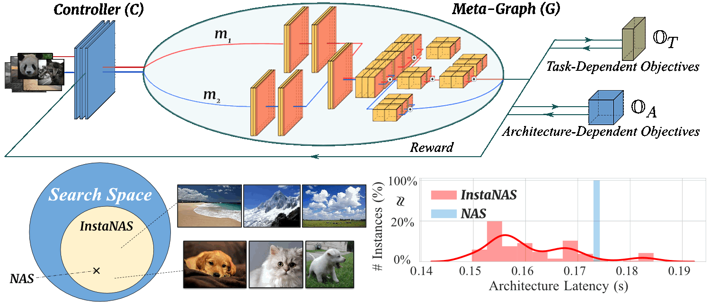

# InstaNAS
### [project page](https://hubert0527.github.io/InstaNAS/) |   [paper](https://arxiv.org/abs/1811.10201)

InstaNAS is an instance-aware neural architecture search framework that employs a controller trained to search for a distribution of architectures instead of a single architecture.



[InstaNAS: Instance-aware Neural Architecture Search
](https://hubert0527.github.io/InstaNAS/)  
 [An-Chieh Cheng](https://anjiezheng.github.io/)\*,  [Chieh Hubert Lin](https://hubert0527.github.io/)\*, [Da-Cheng Juan](https://ai.google/research/people/DaChengJuan), [Wei Wei](https://ai.google/research/people/105672), [Min Sun](http://aliensunmin.github.io)  
 National Tsing Hua University, Google AI  
 In ICML'19 [AutoML Workshop](https://sites.google.com/view/automl2019icml/). (* equal contributions)

## Requirements
* Python 3.6
* PyTorch 0.4.1
* Torchvision

For ImageNet dataset, please follow these data processing [steps](https://github.com/soumith/imagenet-multiGPU.torch#data-processing) and modified the default data path in `utils.py`. 

## Usage
### Pretrain Meta-graph
You can either download our pretrained meta-graph here([CIFAR-10](https://drive.google.com/file/d/1-z2rqfNMMkSPiay1nFiU11R76N3o6JSD/view?usp=sharing), [ImageNet](https://drive.google.com/file/d/1HQj6bqONq1n4hQ-DiDz9QjNMc6nIUexh/view?usp=sharing)) or train from scratch following instructions in [this](https://github.com/felixgwu/img_classification_pk_pytorch) repository. The default path for the meta-graph checkpoint is at `'pretrain/save/`. 
### Search & Finetune
```bash
# Search on CIFAR 10 with pretrained one-shot weights
python search.py --model InstaMobile_C10 --cv_dir YOUR_SAVE_DIR --lr 5e-4 --batch_size 32 --max_epochs 500 --pos_w 30 --neg_w 0

# Finetine on CIFAR 10
python finetune.py --model InstaMobile_C10 --cv_dir YOUR_SAVE_DIR --load YOUR_CHECKPOINT_PATH --max_epochs 300 --batch_size 256
```

```bash
# Search on ImgNet with pretrained one-shot weights
python search.py --model InstaMobile_ImgNet --cv_dir YOUR_SAVE_DIR --lr 5e-4 --net_lr 0.01 --batch_size 100 --max_epochs 50 --pos_w 30 --neg_w 0

# Finetine on ImgNet
python finetune.py --model InstaMobile_ImgNet --cv_dir YOUR_SAVE_DIR --load YOUR_CHECKPOINT_PATH --max_epochs 100 --batch_size 250 --auxiliary
```

## Architecture Selection by Difficulty
The controller selects architectures according to the difficulty of samples. The estimated difficulty matches human perception (e.g., cluttered background, high intra-class variation, illumination conditions).


## Performance
InstaNAS consistently improves MobileNetv2 accuracy-latency tradeoff on 4 datasets. We highlight the values that dominates MobileNetv2 1.0. All InstaNAS variants (i.e., A-E or A-C) are obtained in a single search.


## Distribution Visualization
We project the result architecture distribution to 2D space with UMAP. The result forms multiple clusters and clearly separates high latency architectures from low latency architectures. (Red for high latency and blue for low latency.)


## Citation
Please cite our paper ([link](https://arxiv.org/abs/1811.10201)) 
in your publications if this repo helps your research:

    @article{cheng2018instanas,
    title={InstaNAS: Instance-aware Neural Architecture Search},
    author={Cheng, An-Chieh and Lin, Chieh Hubert and Juan, Da-Cheng and Wei, Wei and Sun, Min},
    journal={arXiv preprint arXiv:1811.10201},
    year={2018}
    }