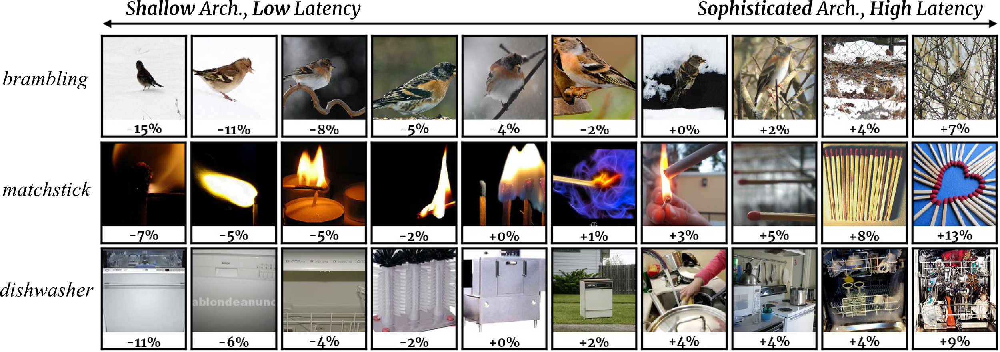
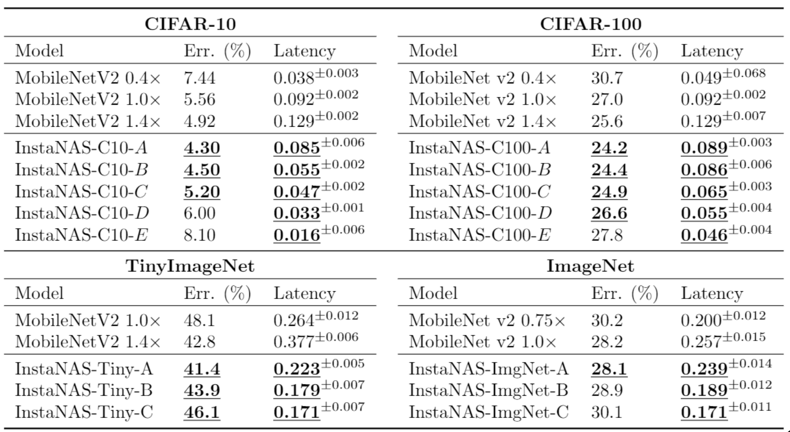
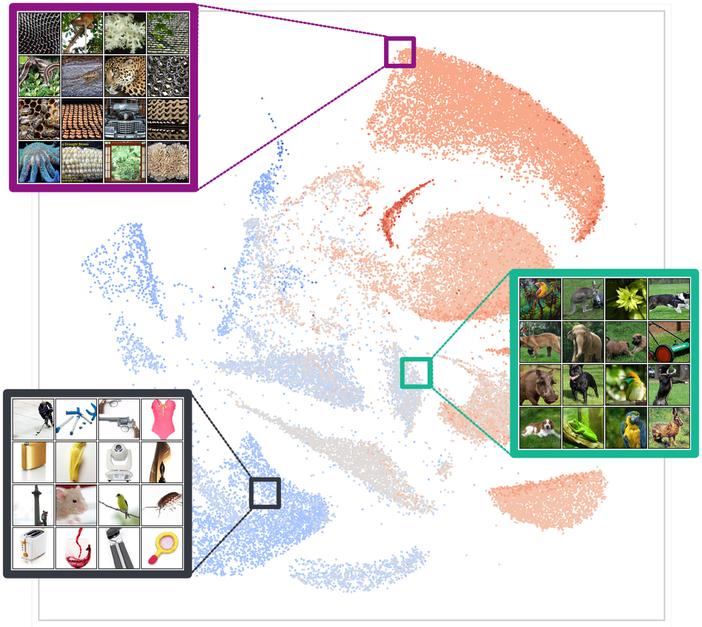

# InstaNAS
### [project page](https://hubert0527.github.io/InstaNAS/) |   [paper](https://arxiv.org/abs/1811.10201)

InstaNAS is an instance-aware neural architecture search framework that employs a controller trained to search for a distribution of architectures instead of a single architecture.

[InstaNAS: Instance-aware Neural Architecture Search
](https://hubert0527.github.io/InstaNAS/)  
 [An-Chieh Cheng](https://anjiezheng.github.io/)\*,  [Chieh Hubert Lin](https://hubert0527.github.io/)\*, [Da-Cheng Juan](https://ai.google/research/people/DaChengJuan), [Wei Wei](https://ai.google/research/people/105672), [Min Sun](http://aliensunmin.github.io)  
 National Tsing Hua University, Google AI  
 In ICML'19 [AutoML Workshop](https://sites.google.com/view/automl2019icml/). (* equal contributions)

## Updates (Search code releasing soon)
* May-2019: Project Page with built-in ImageNet controller released. 

## Architecture Selection by Difficulty
The controller selects architectures according to the difficulty of samples. The estimated difficulty matches human perception (e.g., cluttered background, high intra-class variation, illumination conditions).

## Performance
InstaNAS consistently improves MobileNetv2 accuracy-latency tradeoff on 4 datasets. We highlight the values that dominates MobileNetv2 1.0. All InstaNAS variants (i.e., A-E or A-C) are obtained in a single search.

## Distribution Visualization
We project the result architecture distribution to 2D space with UMAP. The result forms multiple clusters and clearly separates high latency arch. (complex samples) from low latency arch. (simple samples).

### DISCLAIMER
This is not an official Google product.