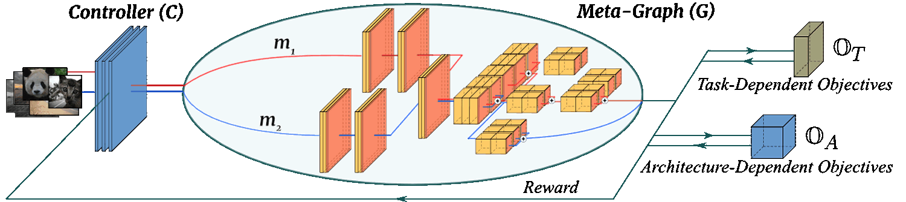

A instance-aware neural architecture search framework that employs a controller trained to search for a distribution of architectures instead of a single architecture.

   

# InstaNAS
### [project page](https://hubert0527.github.io/InstaNAS/) |   [paper](https://arxiv.org/abs/1811.10201)

Torch implementation for learning an image-to-image translation (i.e. [pix2pix](https://github.com/phillipi/pix2pix)) **without** input-output pairs, for example:

[InstaNAS: Instance-aware Neural Architecture Search
](https://hubert0527.github.io/InstaNAS/)  
 [An-Chieh Cheng](https://anjiezheng.github.io/)\*,  [Chieh Hubert Lin](https://hubert0527.github.io/)\*, [Da-Cheng Juan](https://ai.google/research/people/DaChengJuan), [Wei Wei](https://ai.google/research/people/105672), [Min Sun](http://aliensunmin.github.io)  
 National Tsing Hua University, Google AI  
 In ICML'19 [AutoML Workshop](https://sites.google.com/view/automl2019icml/). (* equal contributions)  
